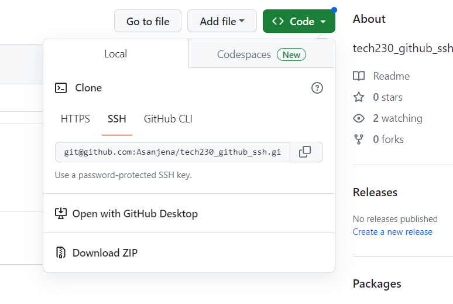

# tech230_github_ssh
tech230_github_ssh

### Git bash

1. In a bash terminal, make sure that you cd to your local user location
2. Type 'ls' and look for a '.ssh' folder. If you do not have one, then you can create a folder called .ssh
3. Type
```
cd .ssh
```
4. Once you are in the right place, type the following:
```
ssh-keygen -t rsa -b 4096 -C "asanje99@gmail.com"
```
5. You should then enter the name of your github repo. The output shouls look like this:


You can then enter add a password on the ssh key, and press enter twice, but this is optional. 

As you can see in the image above, the output wikll display a graphic image and this means that a public and a private key have been generated. 

6. 'ls' to see what keys have been made. In this example, you can see that I have:
```
alema_github_ssh_test

alema_github_ssh_test.pub
```

 

 **note** - the key with the .pub extensiom is the public key. It is important that the key **without** .pub is not sent to anyone. 

 ## Sending public key to github

 1. In github, navigate to settings (by clicking on your profile logo). Then on the dropdowns on the left hand side of the web page, select 'SSH and GPG keys'

 2. Select new SSH key. Give the key a title e.g. alema_github_ssh_test

 3. In your bash terminal, type cat followed by your **public key** e.g., :
 ```
 cat alema_github_ssh_test.pub
 ```

 This will give you a long key that you must copy and paste to github 'key' section. 


4. You may be prompted to login again by entering your password. You should then be able to see your key displayed on the screen. 

5. In your bash terminal, type the following one after the other:

```
ssh-agent -s
```
```
ssh-add ~/.ssh/alema_github_ssh_test
```
```
ssh -T git@github.com
```
The final command will check your connection to github. if you come across issues, try the following:

```
chmod 644 ssh/alema_github_ssh_test
```
```
eval ssh-agent -s
```
```
ssh-add ~/.ssh/alema_github_ssh_test
```
```
ssh -T git@github.com
```
**note** where I have entered lema_github_ssh_test, you would change it to what your tite was when yiu made the key.

If the above steps have been successful, you should get the following output:


## Pushing changes to existing repo

1. Make a change to a file and follow the normal steps to push to github
2. On github, create a new repo. Select the green 'code' icon and choose 'select SSH'. Copy the key:



3. In bash, cd into overal folder e.g. "TECH230 Visualisation"
4. Type git clone and paste the copied SSH:
```
git clone git@github.com:Asanjena/tech230_github_ssh.git
```
5. Finally, 'ls' to see if the repo folder appears
