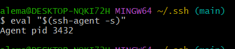

# tech230_github_ssh

This is a guide for using ssh with github.

### Git bash

1. In a bash terminal, make sure that you cd to your local user location
2. Type 'ls' and look for a '.ssh' folder. If you do not have one, then you can create a folder called .ssh
3. Type

```
cd .ssh
```

4. Once you are in the right place, type the following:

```
ssh-keygen -t rsa -b 4096 -C "asanje99@gmail.com"

**note** where I have put asanje99@gmail.com, you would enter your github email.

```
5. You should then enter the name you would like to give to your keys. The output should look like this:


You can then add a password on the ssh key, and press enter twice, but this is optional. 

As you can see in the image above, the output will display a graphic image and this means that a public and a private key have been generated. 

6. 'ls' to see what keys have been made. In this example, you can see that I have:

```
alema_github_ssh_test

alema_github_ssh_test.pub

```

 

 **note** - the key with the .pub extensiom is the public key. It is important that the key **without** .pub is not sent to anyone. 

 ## Sending public key to github

 1. In github, navigate to settings (by clicking on your profile logo). Then on the dropdowns on the left hand side of the web page, select 'SSH and GPG keys'

 2. Select new SSH key. Give the key a title e.g. alema_github_ssh_test

 3. In your bash terminal, type cat followed by your **public key** e.g., :

 ```
 cat alema_github_ssh_test.pub
 ```

 This will give you a long key that you must copy and paste to github 'key' section. 


4. You may be prompted to login again by entering your password. After logging in, you should then be able to see your key displayed on the screen. 

5. In your bash terminal, type the following one after the other:

```
ssh-agent -s
```

```
ssh-add ~/.ssh/alema_github_ssh_test

**note - where I have put alema_github_ssh_test, you would enter the name you gave your key.
```

```
ssh -T git@github.com
```

The final command will check your connection to github. If you come across issues, try the following:

```
eval "$(ssh-agent -s)"

```

This should return the following output:



Follow with the command:

```
ssh-add ~/.ssh/alema_github_ssh_test
```

And finally test the connection to github with:

```
ssh -T git@github.com
```

**note** where I have entered alema_github_ssh_test, you would change it to what you named your key.

If the above steps have been successful, you should get the following output:


### Pulling repos to local machine

1. In your bash terminal, locate to where you would like to put the repo from github, using the 'cd' command.
2. From your github repo, copy the ssh url:


3. In your bash terminal, type 'git clone' and paste the ssh url you copied:


You should then be able to see the repo and a readme file (if you added one when creating your repo) in the right directory. 

## Testing using changes to remote repo

1. Make a change to a file in your repo and follow the normal steps to push to github (git status, git add ., git commit -m "", git push)
2. If this is successful, you should be able to view the changes you have made on github 

If you then work on a file in a different directory; have a sperate key for this; and want to push the changes, then you may need to do the following:
1. In bash, locate to the folder that the file is in using 'cd'
2. Test the connection to github using:

```
ssh -T git@github.com
```
3. If successful, you will get an outputsaying that you have successfully authenticated.
4. Proceed to pushing your changes using th normal git commands. 